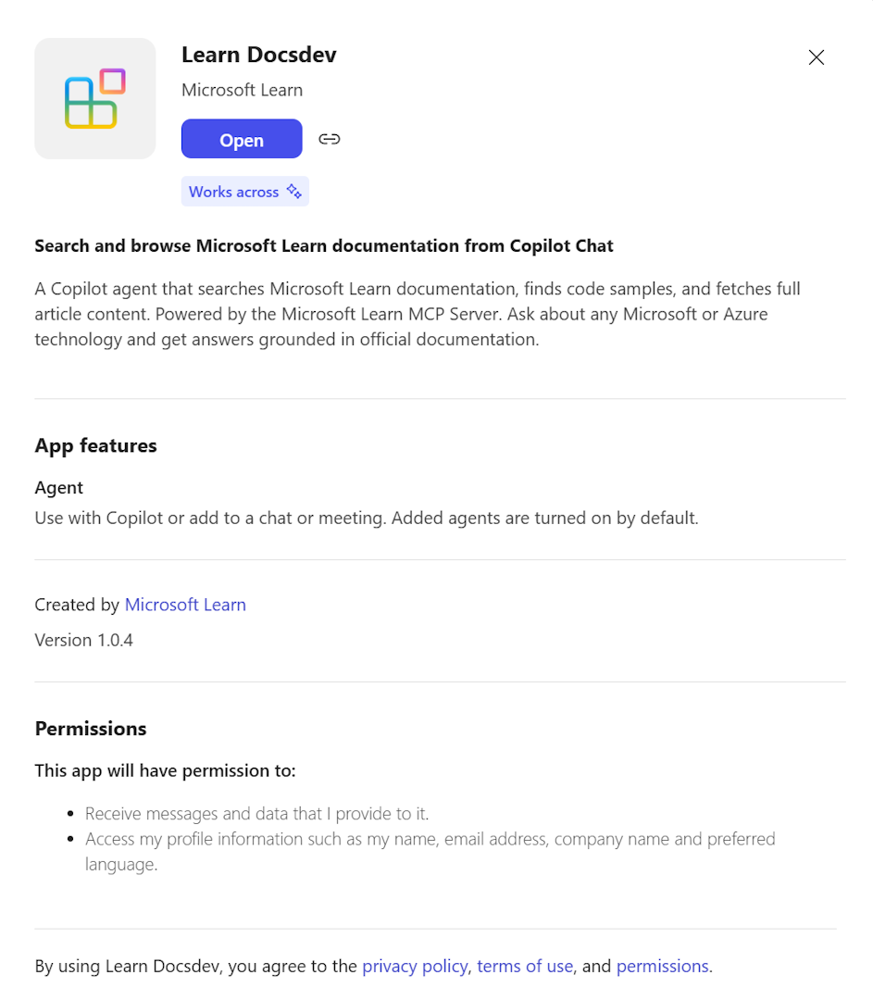
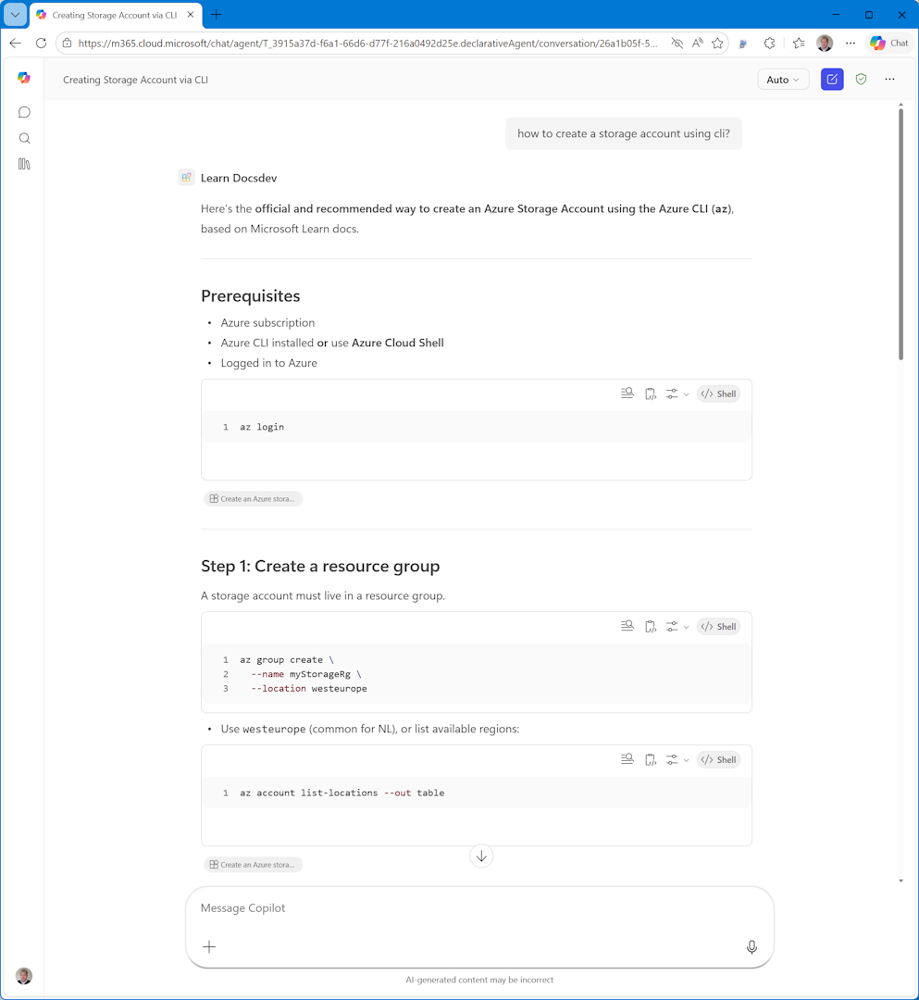

# Microsoft Learn in M365 Copilot Chat

| Agent store listing | Agent in action |
|---|---|
|  |  |

## Context

The [Microsoft Learn MCP Server](https://learn.microsoft.com/api/mcp) gives AI assistants access to official Microsoft documentation through 3 tools: search docs, search code samples, and fetch full articles. It's public, read-only, and requires no authentication.

Today, these tools are available to developers — in VS Code, CLI agents, and as a [certified Power Platform connector](https://learn.microsoft.com/en-us/connectors/microsoftlearndocsmcpserver/) for Copilot Studio. But none of these reach **end users** directly in M365 Copilot Chat. There's a discoverability gap: the capability exists, but it's only accessible to people who build agents, not to people who use them.

## What changed

The [MCP Apps announcement](https://devblogs.microsoft.com/microsoft365dev/mcp-apps-now-available-in-copilot-chat/) (March 2026) was the trigger — agents can now bring interactive UI into M365 Copilot Chat. But for Learn MCP Server, the interactive UI path (MCP Apps) has unclear added value over just browsing learn.microsoft.com. Rendering docs in a chat widget is a worse browser.

What's more interesting is the tools-only path that came before it: **MCP plugins** let you create a declarative agent backed by an MCP server — no UI, just tool calls with text responses and citations — and publish it to the M365 marketplace.

| When | What | Significance |
|---|---|---|
| Dec 2025 | [Declarative agents with MCP plugins](https://devblogs.microsoft.com/microsoft365dev/build-declarative-agents-for-microsoft-365-copilot-with-mcp/) | Developers can package MCP servers as installable Copilot agents |
| Mar 2026 | [ATK v6.6.0 — MCP plugin GA](https://www.voitanos.io/blog/microsoft-365-agents-toolkit-v6-6-0-release-review/) | Production-ready tooling for building and submitting MCP agents |
| Mar 2026 | [MCP Apps in Copilot Chat](https://devblogs.microsoft.com/microsoft365dev/mcp-apps-now-available-in-copilot-chat/) | Agents can also render interactive UI widgets (HTML) inline |

## Integration layers

Each integration serves a different audience and sits at a different level of the stack:

| Layer | Integration | Who it reaches | Discovery |
|---|---|---|---|
| **Protocol** | MCP Server (`learn.microsoft.com/api/mcp`) | Developers building AI tools | Manual config (URL) |
| **Platform** | [Power Platform certified connector](https://learn.microsoft.com/en-us/connectors/microsoftlearndocsmcpserver/) | Agent builders in Copilot Studio | Connector gallery |
| **Product** | **M365 Copilot MCP plugin** (this project) | End users in Copilot Chat | Agent Store |
| **Product + UI** | MCP App (future) | End users, with interactive widgets | Agent Store |

Moving up the stack increases discoverability but adds packaging requirements (manifests, validation, marketplace submission). The protocol and platform layers are already live. This project is a proof of concept for the product layer.

## What this project is

A proof of concept for the product layer: a declarative agent — configuration only, no backend — that packages the Learn MCP Server as an installable M365 Copilot agent. Users find it in the store, add it, and ask documentation questions grounded in official Microsoft content.

This is an **MCP plugin** (tool-only, text responses with citations), not an **MCP App** (interactive UI widgets). We chose the plugin path deliberately:

- **MCP plugin** = agent calls MCP server tools, returns text with citation links. Simple, publishable to marketplace, and the AI synthesis (cross-article answers, contextual code samples) is the value add over browsing learn.microsoft.com directly.
- **MCP App** = agent renders rich HTML UI inline in chat. For Learn content, it's unclear what UI would add beyond what the browser already does well.

## Open questions

- **Is this useful as a product?** Does a "Learn Docs" agent in the store add enough value, or is opening learn.microsoft.com good enough? The hypothesis is that AI synthesis — cross-article answers, contextual code samples, conversational follow-ups — justifies the agent.
- **Should we publish to the marketplace?** The agent can go to the [Microsoft Commercial Marketplace](https://learn.microsoft.com/en-us/microsoft-365/copilot/extensibility/publish) via Partner Center. Worth pursuing?
- **ChatGPT store?** Same MCP server, different submission process. Read-only, public, no auth — straightforward if we want cross-platform reach.
- **MCP App later?** Only if we find a UI that adds something the browser can't: multi-doc synthesis views, interactive architecture diagrams, code playgrounds.

## Why ATK

There are [several ways to build and publish agents](https://learn.microsoft.com/en-us/microsoft-365/copilot/extensibility/publish) for M365 Copilot:

| Tool | Org catalog | Marketplace | MCP support |
|---|---|---|---|
| **M365 Agents Toolkit (ATK)** | ✅ | ✅ | ✅ |
| Copilot Studio | ✅ | ❌ | ❌ |
| Agent Builder (in Copilot) | ✅ | ❌ | ❌ |
| SharePoint agents | ❌ | ❌ | ❌ |

ATK is the only option that supports both marketplace submission and MCP server integration. The others are limited to org-internal distribution, or don't support MCP at all.

## Why declarative agent with MCP plugin

Within ATK, the wizard offers several starting points. We chose **Declarative Agent → Start with an MCP Server** because:

- The Learn MCP Server already exists and is public — no backend to build
- A declarative agent is configuration-only (manifests + instructions), which is the simplest possible packaging
- The MCP plugin runtime (`RemoteMCPServer`) connects directly to the server at `learn.microsoft.com/api/mcp` — no proxy, no middleware
- All 3 tools are read-only with no auth, so no OAuth setup needed

The result is a zero-code agent: a zip of JSON files and icons that tells M365 Copilot where the MCP server is and how to use it.

## How we built this

### Timeline

MCP server support for M365 Copilot declarative agents was [announced in December 2025](https://devblogs.microsoft.com/microsoft365dev/build-declarative-agents-for-microsoft-365-copilot-with-mcp/) and reached **GA in March 2026** with ATK v6.6.0. This project was built in April 2026.

### What worked

1. **ATK wizard scaffolding** — Created a new declarative agent via "Start with an MCP Server" in the M365 Agents Toolkit VS Code extension
2. **ATK "Fetch action from MCP" button** — Pulled tool schemas directly from the live server, generating correctly-formatted `ai-plugin.json` and `mcp-tools.json`
3. **Iterative provisioning** — Small changes, provision, test, repeat

### What didn't work (lessons learned)

We initially hand-crafted all manifest files from documentation. This failed with persistent HTTP 400 errors during `extendToM365`. The errors were unhelpful ("Internal Error - Failed to make a successful HTTP request"). After extensive debugging, the root causes were:

| Problem | Symptom | Fix |
|---|---|---|
| `mcp-tools.json` was a bare array `[...]` | 400 during `extendToM365` | Must be `{"tools": [...]}` |
| Missing `$schema` in `ai-plugin.json` | Validation failure | Add `"$schema": "https://developer.microsoft.com/json-schemas/copilot/plugin/v2.4/schema.json"` |
| Missing `namespace` and `contact_email` | Validation failure | Required fields in ai-plugin.json |
| `run_for_functions` was empty `[]` | Explicit validation error | Must list all function names |
| Old schema versions (manifest v1.19, agent v1.3) | Silent failures | Use manifest v1.25, agent v1.6, YAML v1.11 |
| Config file named `teamsapp.yml` | ATK didn't recognize project | Must be `m365agents.yml` for ATK v6.3+ |

**Lesson:** Use the ATK wizard to scaffold and fetch tools. Don't hand-craft manifest files — the validation is opaque and the format requirements are underdocumented.

### Prerequisites that blocked us

- **Copilot license** — Even on M365 Developer Program sandbox tenants, you must purchase and assign a Copilot license. Without it: "Microsoft 365 account administrator hasn't enabled Copilot access for this account"
- **Custom app upload** — Must be enabled in Teams admin center → Setup policies → Upload custom apps
- **Version bumping** — Every `extendToM365` call requires a higher `version` in manifest.json than the previous deployment

## Implementation

For technical details — architecture, project structure, file explanations, and setup — see **[tech.md](tech.md)**.

## References

- [Build declarative agents with MCP](https://devblogs.microsoft.com/microsoft365dev/build-declarative-agents-for-microsoft-365-copilot-with-mcp/) — announcement blog
- [MCP Apps in Copilot Chat](https://devblogs.microsoft.com/microsoft365dev/mcp-apps-now-available-in-copilot-chat/) — UI widgets announcement
- [Build MCP plugins](https://learn.microsoft.com/en-us/microsoft-365/copilot/extensibility/build-mcp-plugins) — official guide
- [Publish agents](https://learn.microsoft.com/en-us/microsoft-365/copilot/extensibility/publish) — distribution options
- [Learn MCP Server connector](https://learn.microsoft.com/en-us/connectors/microsoftlearndocsmcpserver/) — certified Power Platform connector
